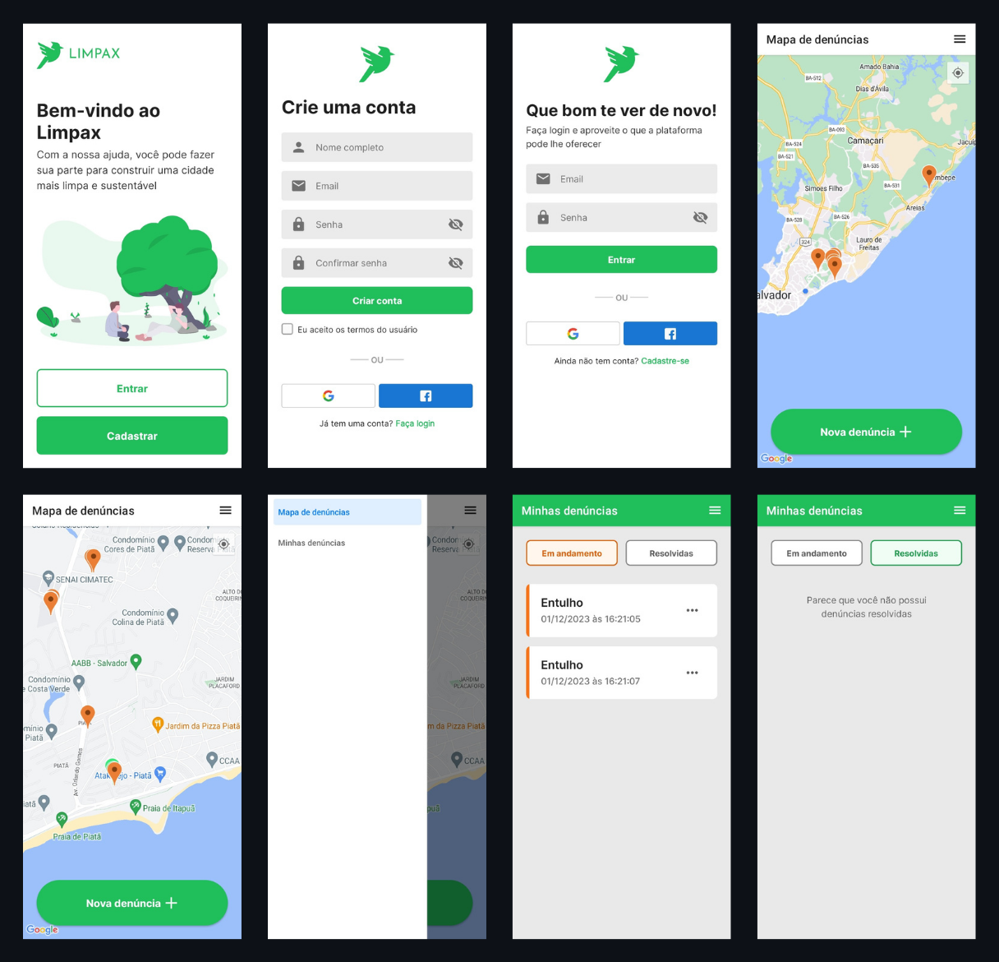

# Limpax

## O que é o Limpax?

O aplicativo Limpax foi criado num projeto de escola, com o objetivo de implementar uma solução para um problema social da cidade de Salvador-BA.

Ele foi criado para demonstrar como a poluição da cidade poderia ser amenizada através do uso de um aplicativo no qual a população seria capaz de notificar locais onde havia acúmulo de lixo. 

Essas notificações seriam vistas pela prefeitura da cidade ou a empresa concessionária, e tendo os dados em mãos, teriam como sanar o problema de poluição.

## Tecnologias usadas no projeto

- [React](https://react.dev/) 
- [React Native](https://reactnative.dev/) 
- [React-Navigation](https://reactnavigation.org/)
- [React Native Scalable Image](https://github.com/ihor/react-native-scalable-image)
- [Native Base](https://nativebase.io/)
- [Expo](https://expo.dev/)
- [Babel](https://babeljs.io/)
- [Firebase](https://firebase.google.com/)

## Gostou? Tem uma sugestão?
**Me conta o que achou!** Seu feedback é muito importante para o meu crescimento e a melhora deste projeto.

Pode falar comigo por:
- Email: bernardoeulersantos@gmail.com
- LinkedIn: [in/bernardoeuler](https://www.linkedin.com/in/bernardoeuler)
- Discord: [bernardoeuler](https://discord.com/users/367741578808393729)

## Obrigado!

Obrigado por ter vindo até aqui. Que tal dar uma olhada em outros projetos interessantes como este?

- [BINARY TO DECIMAL](https://github.com/bernardoeuler/binary-to-decimal-converter) - Conversor de binário para decimal
- [TO-DO LIST APP](https://github.com/bernardoeuler/todo-app) - Aplicativo de lista de tarefas
- [CRAPPO](https://github.com/bernardoeuler/crappo-landing-page) - Landing page fictícia